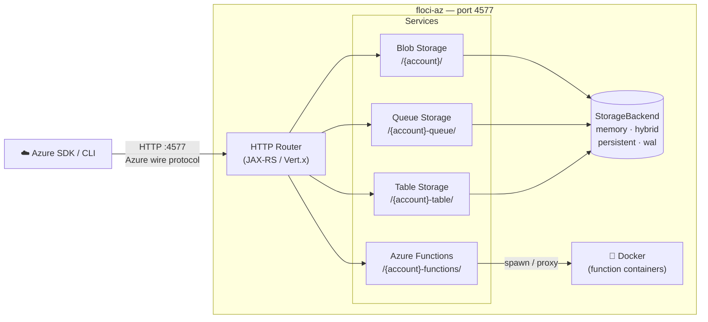

<p align="center">
  <a href="https://github.com/floci-io/floci-az/releases/latest"></a>
  <a href="https://github.com/floci-io/floci-az/actions/workflows/release.yml"></a>
  <a href="https://hub.docker.com/r/floci-io/floci-az"></a>
  <a href="https://hub.docker.com/r/floci-io/floci-az"></a>
  <a href="https://opensource.org/licenses/MIT"></a>
</p>

<p align="center">
  A free, open-source local Azure emulator — Storage and Functions. No account. No feature gates. Just&nbsp;<code>docker compose up</code>.
</p>

---

> The companion to [floci](https://github.com/floci-io/floci) — floci emulates AWS, floci-az emulates Azure.

## Why floci-az?

| | floci-az | [Azurite](https://github.com/Azure/Azurite) | [Functions Core Tools](https://github.com/Azure/azure-functions-core-tools) |
|---|---|---|---|
| Blob Storage | ✅ | ✅ | ❌ |
| Queue Storage | ✅ | ✅ | ❌ |
| Table Storage | ✅ | ✅ | ❌ |
| Azure Functions | ✅ | ❌ | ✅ |
| Startup time | **fast** | Moderate | Fast |
| Native binary | ✅ | ❌ | ✅ |
| Unified port (4577) | ✅ | ❌ | ❌ |
| Per-service storage modes | ✅ | ❌ | ❌ |
| WAL / hybrid persistence | ✅ | ❌ | ❌ |
| License | **MIT** | MIT | MIT |

## Architecture Overview



## Supported Services

| Service | Routing | Notable operations |
|---|---|---|
| **Blob Storage** | `/{account}/` | Create/delete containers, upload/download/delete blobs, list blobs |
| **Queue Storage** | `/{account}-queue/` | Create/delete queues, send/receive/peek/delete messages, visibility timeout |
| **Table Storage** | `/{account}-table/` | Create/delete tables, insert/get/update/upsert/delete entities, list entities |
| **Azure Functions** | `/{account}-functions/` | Deploy & invoke HTTP-triggered functions (node, python, java, dotnet); warm-container pool |

## Persistence & Storage Modes

floci-az features the same flexible storage architecture as floci. Configure the storage mode globally via `FLOCI_AZ_STORAGE_MODE` or override it per service.

| Mode | Behavior | Best for... | Durability |
|:---:|---|---|:---:|
| **`memory`** **(Default)** | Entirely in-RAM. Data is lost when the container stops. | Speed, ephemeral testing, CI pipelines. | ❌ None |
| **`persistent`** | Data is loaded at startup and flushed to disk on graceful shutdown. | Simple local dev with state preservation. | ⚠️ Medium |
| **`hybrid`** | In-memory performance with periodic async flushing (every 5s). | The perfect balance of speed and safety. | ✅ Good |
| **`wal`** | Write-Ahead Log. Every mutation is logged to disk before responding. | Maximum durability for critical state. | 💎 Highest |

> [!TIP]
> Use **`hybrid`** for a "it just works" experience that survives container restarts. For ephemeral integration tests where state doesn't matter, keep the default **`memory`** mode for maximum performance.

## Quick Start

```yaml
# docker-compose.yml
services:
  floci-az:
    image: floci/floci-az:latest
    ports:
      - "4577:4577"
    volumes:
      # Local directory bind mount (default)
      - ./data:/app/data

      # OR named volume (optional):
      # - floci-az-data:/app/data

      - /var/run/docker.sock:/var/run/docker.sock  # required for Azure Functions

#volumes:
#  floci-az-data:
```

```bash
docker compose up
```

Or run directly:

```bash
docker run -d --name floci-az \
  -p 4577:4577 \
  -v /var/run/docker.sock:/var/run/docker.sock \
  floci/floci-az:latest
```

All services are available at `http://localhost:4577`. Use any account name and key — in `dev` auth mode credentials are not validated.

> **Azure Functions** requires access to the Docker socket so floci-az can spawn runtime containers on demand. Mount `/var/run/docker.sock` as shown above. If you don't use Functions, the socket mount is optional.

## CLI Usage (`azfloci`)

The `azfloci` tool is a companion Python CLI that acts as a transparent proxy for the official Azure CLI (`az`). It dynamically injects the correct connection strings and disables SSL verification so you can use standard `az` commands against the local emulator.

### Setup

```bash
# Optional: alias azfloci as az for a seamless experience
alias az='python3 /path/to/floci-az/azfloci/azfloci.py'

# Initialize or get connection string info
az setup
```

### Examples

When using `azfloci`, you don't need to pass `--connection-string` or set environment variables manually.

#### Blob Storage
```bash
# Create a container
az storage container create --name my-container

# Upload a blob
az storage blob upload --container-name my-container --name hello.txt --file hello.txt

# List blobs
az storage blob list --container-name my-container --output table
```

#### Queue Storage
```bash
# Create a queue
az storage queue create --name my-queue

# Send a message
az storage message put --queue-name my-queue --content "Hello from CLI"
```

#### Table Storage
```bash
# Create a table
az storage table create --name MyTable
```

> [!NOTE]
> `azfloci` automatically detects the `--account-name` argument (defaulting to `devstoreaccount1`) and constructs the appropriate local endpoint.

## SDK Integration

floci-az uses path-style routing:

| Service | Endpoint |
|---|---|
| Blob | `http://localhost:4577/{accountName}` |
| Queue | `http://localhost:4577/{accountName}-queue` |
| Table | `http://localhost:4577/{accountName}-table` |
| Functions | `http://localhost:4577/{accountName}-functions` |

The standard development storage connection string works out of the box:

```
DefaultEndpointsProtocol=http;AccountName=devstoreaccount1;AccountKey=Eby8vdM02xNOcqFlqUwJPLlmEtlCDXJ1OUzFT50uSRZ6IFsuFq2UVErCz4I6tq/K1SZFPTOtr/KBHBeksoGMh0==;BlobEndpoint=http://localhost:4577/devstoreaccount1;QueueEndpoint=http://localhost:4577/devstoreaccount1-queue;TableEndpoint=http://localhost:4577/devstoreaccount1-table;
```

```python
# Python (azure-storage-blob)
from azure.storage.blob import BlobServiceClient

conn_str = (
    "DefaultEndpointsProtocol=http;AccountName=devstoreaccount1;"
    "AccountKey=Eby8vdM02xNOcqFlqUwJPLlmEtlCDXJ1OUzFT50uSRZ6IFsuFq2UVErCz4I6tq/K1SZFPTOtr/KBHBeksoGMh0==;"
    "BlobEndpoint=http://localhost:4577/devstoreaccount1;"
)

client = BlobServiceClient.from_connection_string(conn_str)
client.create_container("my-container")

blob = client.get_container_client("my-container").get_blob_client("hello.txt")
blob.upload_blob(b"Hello from floci-az!")

data = blob.download_blob().readall()
print(data)
```

```python
# Python (azure-storage-queue)
from azure.storage.queue import QueueServiceClient

conn_str = (
    "DefaultEndpointsProtocol=http;AccountName=devstoreaccount1;"
    "AccountKey=Eby8vdM02xNOcqFlqUwJPLlmEtlCDXJ1OUzFT50uSRZ6IFsuFq2UVErCz4I6tq/K1SZFPTOtr/KBHBeksoGMh0==;"
    "QueueEndpoint=http://localhost:4577/devstoreaccount1-queue;"
)

client = QueueServiceClient.from_connection_string(conn_str)
queue = client.create_queue("my-queue")
queue.send_message("Hello from floci-az!")

messages = list(queue.receive_messages())
print(messages[0].content)
```

```python
# Python (azure-data-tables)
from azure.data.tables import TableServiceClient

conn_str = (
    "DefaultEndpointsProtocol=http;AccountName=devstoreaccount1;"
    "AccountKey=Eby8vdM02xNOcqFlqUwJPLlmEtlCDXJ1OUzFT50uSRZ6IFsuFq2UVErCz4I6tq/K1SZFPTOtr/KBHBeksoGMh0==;"
    "TableEndpoint=http://localhost:4577/devstoreaccount1-table;"
)

service = TableServiceClient.from_connection_string(conn_str)
table = service.create_table("MyTable")
table.create_entity({"PartitionKey": "pk1", "RowKey": "rk1", "Value": "hello"})

entity = table.get_entity("pk1", "rk1")
print(entity["Value"])
```

```java
// Java (Azure SDK for Java)
BlobServiceClient client = new BlobServiceClientBuilder()
    .connectionString(
        "DefaultEndpointsProtocol=http;AccountName=devstoreaccount1;" +
        "AccountKey=Eby8vdM02xNOcqFlqUwJPLlmEtlCDXJ1OUzFT50uSRZ6IFsuFq2UVErCz4I6tq/K1SZFPTOtr/KBHBeksoGMh0==;" +
        "BlobEndpoint=http://localhost:4577/devstoreaccount1;")
    .buildClient();

client.createBlobContainer("my-container");

BlobClient blob = client.getBlobContainerClient("my-container").getBlobClient("hello.txt");
blob.upload(new ByteArrayInputStream("Hello from floci-az!".getBytes()), 20);

BlobDownloadResponse response = blob.downloadWithResponse(/* ... */);
```

```typescript
// Node.js / TypeScript (Azure SDK)
import { BlobServiceClient } from "@azure/storage-blob";

const CONN =
  "DefaultEndpointsProtocol=http;AccountName=devstoreaccount1;" +
  "AccountKey=Eby8vdM02xNOcqFlqUwJPLlmEtlCDXJ1OUzFT50uSRZ6IFsuFq2UVErCz4I6tq/K1SZFPTOtr/KBHBeksoGMh0==;" +
  "BlobEndpoint=http://localhost:4577/devstoreaccount1;";

const client = BlobServiceClient.fromConnectionString(CONN);
const { containerClient } = await client.createContainer("my-container");

const blob = containerClient.getBlockBlobClient("hello.txt");
await blob.upload(Buffer.from("Hello from floci-az!"), 20);

const downloaded = await blob.downloadToBuffer();
console.log(downloaded.toString());
```

### Azure Functions

Functions are managed via a REST management API and invoked over HTTP. The emulator spawns a real Azure Functions runtime container (node, python, java, or dotnet) on first invoke and keeps it warm for subsequent calls.

```bash
BASE="http://localhost:4577/devstoreaccount1-functions"

# 1. Create a function app
curl -s -X PUT "$BASE/admin/apps/my-app" \
  -H "Content-Type: application/json" \
  -d '{"runtime":"node","environment":{"MY_VAR":"hello"}}'

# 2. Deploy a function (ZIP of your function code, base64-encoded)
ZIP_B64=$(base64 < my-function.zip)
curl -s -X PUT "$BASE/admin/apps/my-app/functions/hello" \
  -H "Content-Type: application/json" \
  -d "{\"handler\":\"index.handler\",\"timeoutSeconds\":60,\"zipBase64\":\"$ZIP_B64\"}"

# 3. Invoke
curl "$BASE/api/my-app/hello?msg=world"
```

```bash
# Management endpoints
GET    $BASE/admin/apps                                  # list apps
PUT    $BASE/admin/apps/{app}                            # create / update app
GET    $BASE/admin/apps/{app}                            # get app
DELETE $BASE/admin/apps/{app}                            # delete app + all functions

GET    $BASE/admin/apps/{app}/functions                  # list functions
PUT    $BASE/admin/apps/{app}/functions/{fn}             # deploy function
GET    $BASE/admin/apps/{app}/functions/{fn}             # get function
DELETE $BASE/admin/apps/{app}/functions/{fn}             # delete function

# Invocation
GET|POST  $BASE/api/{app}/{fn}[?query...]                # invoke HTTP trigger
```

Supported runtimes: `node`, `python`, `java`, `dotnet`.

## Compatibility Testing

> For full validation against real Azure SDK workflows, see the [compatibility-tests](./compatibility-tests/) directory.

| Module | Language | SDK | Tests |
|---|---|---|---:|
| `sdk-test-python` | Python 3 | azure-storage-blob / queue / data-tables | 17 |
| `sdk-test-java` | Java 21 | Azure SDK for Java (BOM 1.2.28) + Functions management API | 32 |
| `sdk-test-node` | Node.js | @azure/storage-blob / storage-queue / data-tables | 16 |

Run all compatibility tests against a running container:

```bash
make test-python
make test-java-compat
make test-node-compat
```

## Image Tags

| Tag | Description |
|---|---|
| `latest` | Native image — sub-second startup **(recommended)** |
| `latest-jvm` | JVM image |
| `x.y.z` / `x.y.z-jvm` | Pinned releases |
| `edge` | Weekly build from main |

## Configuration

All settings are overridable via environment variables (`FLOCI_AZ_` prefix).

| Variable                                      | Default | Description |
|-----------------------------------------------|---|---|
| `FLOCI_AZ_PORT`                               | `4577` | Port exposed by the API |
| `FLOCI_AZ_STORAGE_MODE`                       | `memory` | Global storage mode: `memory` · `persistent` · `hybrid` · `wal` |
| `FLOCI_AZ_STORAGE_PATH`                       | `~/.floci-az/data` | Directory for persisted state |
| `FLOCI_AZ_AUTH_MODE`                          | `dev` | `dev` — accept any credentials · `strict` — validate HMAC-SHA256 |
| `FLOCI_AZ_SERVICES_BLOB_ENABLED`              | `true` | Enable or disable Blob Storage |
| `FLOCI_AZ_SERVICES_QUEUE_ENABLED`             | `true` | Enable or disable Queue Storage |
| `FLOCI_AZ_SERVICES_TABLE_ENABLED`             | `true` | Enable or disable Table Storage |
| `FLOCI_AZ_SERVICES_FUNCTIONS_ENABLED`         | `true` | Enable or disable Azure Functions |
| `FLOCI_AZ_SERVICES_FUNCTIONS_DOCKER_HOST`     | `unix:///var/run/docker.sock` | Docker socket used to spawn function containers |
| `FLOCI_AZ_SERVICES_FUNCTIONS_CODE_PATH`       | `~/.floci-az/functions` | Directory where deployed function ZIPs are extracted |
| `FLOCI_AZ_SERVICES_FUNCTIONS_EPHEMERAL`       | `false` | `true` — fresh container per invocation; `false` — warm-container pool |
| `FLOCI_AZ_SERVICES_FUNCTIONS_IDLE_TIMEOUT_MS` | `300000` | Evict warm containers idle longer than this (ms) |

### Per-service storage override

You can set a different storage mode for each service independently, without changing the global default:

```yaml
# docker-compose.yml
environment:
  FLOCI_AZ_STORAGE_MODE: memory                    # global default
  FLOCI_AZ_STORAGE_SERVICES_BLOB_MODE: wal         # blob uses WAL
  FLOCI_AZ_STORAGE_SERVICES_QUEUE_MODE: hybrid     # queue uses hybrid
  # table falls back to global: memory
```

This is useful when you want blob data to survive restarts (`wal`) but keep queue state ephemeral (`memory`) during development.

### Multi-container Docker Compose

When your application runs in a separate container, use the service name as the hostname:

```yaml
services:
  floci-az:
    image: floci/floci-az:latest
    ports:
      - "4577:4577"
    volumes:
      - /var/run/docker.sock:/var/run/docker.sock  # required for Azure Functions
    networks:
      - app-net

  my-app:
    environment:
      AZURE_BLOB_ENDPOINT: http://floci-az:4577/devstoreaccount1
      AZURE_QUEUE_ENDPOINT: http://floci-az:4577/devstoreaccount1-queue
      AZURE_TABLE_ENDPOINT: http://floci-az:4577/devstoreaccount1-table
      AZURE_FUNCTIONS_ENDPOINT: http://floci-az:4577/devstoreaccount1-functions
    depends_on:
      floci-az:
        condition: service_healthy
    networks:
      - app-net

networks:
  app-net:
```

## License

MIT — use it however you want.
